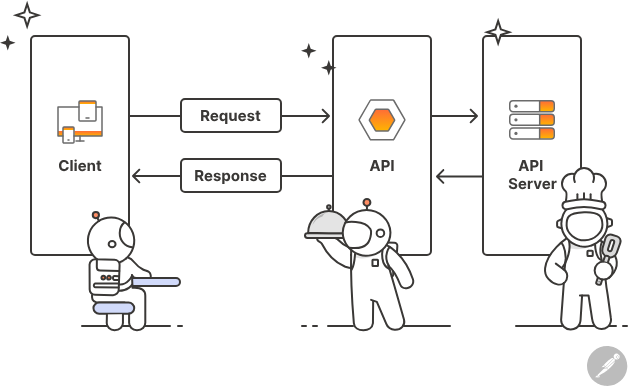

# Week 1: Basic API

An API (Application Programming Interface) is an interface that allows different systems to communicate, typically through requests and responses.


## REST API

A REST (Representational State Transfer) API is a type of API that adheres to the principles of REST architecture. It uses standard HTTP methods (GET, POST, PUT, DELETE) for communication and is stateless, meaning each request from a client to server must contain all the information needed to understand and process the request.

Below is a beginner-friendly quick reference for the most commonly used HTTP methods in REST APIs. The table highlights whether the method usually has a request body or response body, if it is considered safe or idempotent, whether responses can be cached, and a short beginner note describing a typical use.

| Method | Request has body? | Response has body? | Safe? | Idempotent? | Cacheable? | Notes |
|---|:---:|:---:|:---:|:---:|:---:|---:|
| GET | No (usually) | Yes | Yes | Yes | Yes (often) | Retrieve data. Use GET to read resources without changing them. Cached by browsers and proxies. |
| POST | Yes | Yes (usually) | No | No | No (usually) | Create a new resource or submit data to the server (e.g., create a user, submit a form). Each POST can create a new resource. |
| PUT | Yes | Yes (often) | No | Yes | No | Replace an existing resource entirely (or create it at a known URL). Repeating the same PUT should have the same result. |
| DELETE | No (sometimes) | No / Yes | No | Yes | No | Remove a resource. Calling DELETE multiple times has the same effect as calling it once (resource gone). |
| PATCH | Yes | Yes (often) | No | No (usually) | No | Partially update a resource (only the fields you send are changed). Not necessarily idempotent unless implemented that way. |

Notes:

- "Safe" means the method should not change server state (GET is safe; others usually change state).
- "Idempotent" means repeating the same request produces the same result (PUT and DELETE are idempotent in theory).
- Cacheability depends on server headers (Cache-Control, ETag) and the specifics of the response.

<!-- HTTP codes -->

## HTTP Status Codes (quick bracket for beginners)

HTTP status codes are returned by the server to tell the client what happened with the request. They're grouped by the first digit:

- 1xx: Informational (rarely seen in basic web apps)
- 2xx: Success — the request worked
- 3xx: Redirection — follow a new location
- 4xx: Client error — something wrong with the request
- 5xx: Server error — something went wrong on the server

| Group | Common codes | What they mean (short) |
|---|---:|---|
| 2xx | 200 OK | Request succeeded; response contains the requested data |
| 2xx | 201 Created | Resource created (commonly after POST) |
| 3xx | 301 Moved Permanently | Resource moved; client should use new URL |
| 4xx | 400 Bad Request | Server couldn't understand the request (invalid data) |
| 4xx | 401 Unauthorized | Authentication required or failed |
| 4xx | 403 Forbidden | Authenticated but not allowed to access resource |
| 4xx | 404 Not Found | Resource doesn't exist at the given URL |
| 5xx | 500 Internal Server Error | Unexpected server error |

> **Try for yourself!**\
>Inspect any popular website (e.g., GitHub, Twitter) using your browser's developer tools (usually F12 or right-click -> Inspect). Go to the "Network" tab and reload the page. You will see various HTTP requests made by the website. Look for requests with methods like GET, POST, etc., and click on them to see details such as headers, request body, and response body.

<details>
  <summary> click ot view Result!</summary>
  
</details>

## Real World APIs

Let's explore some real-world APIs that you can interact with to practice your skills:

### Rick and Morty API

- **URL**: [https://rickandmortyapi.com/api](https://rickandmortyapi.com/api)
- **Documentation**: [https://rickandmortyapi.com/documentation](https://rickandmortyapi.com/documentation)
- **Description**: A fun REST API for the Rick and Morty TV show. Query characters, episodes, and locations. No authentication required!
- **Example Request**:

  ```bash
  curl -i https://rickandmortyapi.com/api/character/1
  ```
  
### GitHub

- **URL**: [https://api.github.com](https://api.github.com)
- **Documentation**: [https://docs.github.com/en/rest](https://docs.github.com/en/rest)
- **Description**: GitHub's REST API allows you to interact with repositories, issues, pull requests, and more.
- **Example Request**:

  ```bash
  curl -i https://api.github.com/users/code-victor
  ```

### REST Countries

- **URL**: [https://restcountries.com/v3.1/all](https://restcountries.com/v3.1/all)
- **Documentation**: [https://restcountries.com](https://restcountries.com)
- **Description**: Provides information about countries, including name, population, area, and more.
- **Example Request**:

  ```bash
  curl -i https://restcountries.com/v3.1/name/nigeria
  ```

> Notice the consistent structure of the URLs: different endpoints map predictably to different resources — this is intentional. A consistent URL design makes APIs easier to discover, understand, and use. For guidance on RESTful API design, see Microsoft's REST API Guidelines: <https://github.com/microsoft/api-guidelines>

## API Testing Tools or Clients

1. **cURL**: A command-line tool for making HTTP requests. It's great for quick tests and can be used in scripts.
   - **Website**: [https://curl.se](https://curl.se)

2. **Postman**: A popular tool for testing APIs with a user-friendly interface. You can create requests, organize them into collections, and even automate tests.
   - **Website**: [https://www.postman.com](https://www.postman.com)

3. **Thunder Client**: A REST API client extension for Visual Studio Code. It allows you to send HTTP requests and view responses directly within the editor.
   - **Website**: [https://marketplace.visualstudio.com/items?itemName=rangav.vscode-thunder-client](https://marketplace.visualstudio.com/items?itemName=rangav.vscode-thunder-client)

## Practice, Practice, Practice

### Python `requests` Module Crash Course

The `requests` module is the most popular Python library for making HTTP requests. It's simple, intuitive, and handles many details for you.

#### Installation

```bash
pip install requests
```

#### Basic GET Request

```python
import requests

# Fetch a character
response = requests.get('https://rickandmortyapi.com/api/character/1')

# Check status code
print(response.status_code)  # 200

# Get JSON data
data = response.json()
print(data['name'])  # Rick Sanchez
print(data['species'])  # Human
```

#### POST Request (create a resource)

**Note**: The Rick and Morty API is read-only, so we'll show a conceptual example. In real APIs that support POST, you'd do:

```python
import requests

# Data to send (conceptual example)
payload = {
    'name': 'Summer Smith',
    'species': 'Human',
    'status': 'Alive'
}

# In a real writable API:
# response = requests.post(
#     'https://api.example.com/characters',
#     json=payload  # Automatically sets Content-Type: application/json
# )
# print(response.status_code)  # 201
# print(response.json())

# Since Rick and Morty API is read-only, let's fetch multiple characters instead:
response = requests.get('https://rickandmortyapi.com/api/character')
print(response.status_code)  # 200
print(f"Total characters: {response.json()['info']['count']}")
```

#### Custom Headers & Query Parameters

```python
import requests

# Add headers (e.g., authentication - not needed for Rick and Morty API)
headers = {'User-Agent': 'Python Requests Tutorial'}

# Add query parameters (?key=value)
# Filter characters by name
params = {'name': 'rick'}

response = requests.get(
    'https://rickandmortyapi.com/api/character',
    headers=headers,
    params=params
)

print(response.url)  # Shows full URL with query string
print(f"Found {len(response.json()['results'])} characters")
for character in response.json()['results']:
    print(f"- {character['name']} ({character['species']})")
```

#### Error Handling

```python
import requests

try:
    # Try to fetch a character that doesn't exist
    response = requests.get('https://rickandmortyapi.com/api/character/999999')
    
    # Raise exception for 4xx/5xx status codes
    response.raise_for_status()
    
    data = response.json()
    print(data)
    
except requests.exceptions.HTTPError as e:
    print(f"HTTP Error: {e}")  # 404 Not Found
except requests.exceptions.RequestException as e:
    print(f"Request failed: {e}")  # Network errors, timeouts, etc.
```

#### PUT & DELETE

**Note**: The Rick and Morty API is read-only. Below are conceptual examples of how PUT, PATCH, and DELETE work with writable APIs:

```python
import requests

# Update (PUT) - conceptual example
# response = requests.put(
#     'https://api.example.com/characters/1',
#     json={'name': 'Rick Sanchez', 'status': 'Alive', 'species': 'Human'}
# )
# print(response.status_code)  # 200

# Partial update (PATCH) - conceptual example
# response = requests.patch(
#     'https://api.example.com/characters/1',
#     json={'status': 'Deceased'}
# )
# print(response.json())

# Delete - conceptual example
# response = requests.delete('https://api.example.com/characters/1')
# print(response.status_code)  # 200 or 204

# Real example with Rick and Morty API - fetch episodes
response = requests.get('https://rickandmortyapi.com/api/episode/1')
episode = response.json()
print(f"Episode: {episode['name']}")
print(f"Air date: {episode['air_date']}")
```

#### Quick Tips

- **Always check `response.status_code`** before processing data
- Use **`response.json()`** for JSON APIs (raises error if not valid JSON)
- Use **`response.text`** for plain text or HTML
- Use **`response.raise_for_status()`** to automatically catch HTTP errors
- Set **timeouts** to avoid hanging: `requests.get(url, timeout=5)`
- For authentication, pass headers: `headers={'Authorization': 'Bearer token'}`

#### Mini Exercise

Try fetching characters from the Rick and Morty API:

```python
import requests

# Fetch a random character (1-826)
character_id = 5  # Try different numbers!
response = requests.get(f'https://rickandmortyapi.com/api/character/{character_id}')

if response.status_code == 200:
    character = response.json()
    print(f"Name: {character['name']}")
    print(f"Status: {character['status']}")
    print(f"Species: {character['species']}")
    print(f"Location: {character['location']['name']}")
else:
    print(f"Error: {response.status_code}")
```

Try changing `character_id` to different numbers (1-826) and see what you get!
